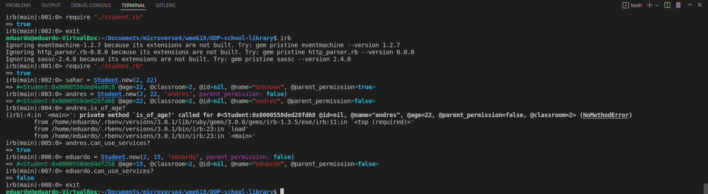

# OOP-school-library
Backend application to record what books are in the library and who borrows them.


## Preview


## Built With

- Major languages: Ruby
- Frameworks: N/A
- Technologies used: N/A

## Live Demo (if available)

[N/A](https://github.com/eduardosancho/decode_morse)


## Getting Started

To get a local copy up and running follow these simple example st

### Prerequisites
- `ruby` : `^3.0.1` required for running the code.
- `gem` : `^3.2.15` required for linters.

### Setup
Run the following command in your terminal to clone this repo to your local machine `
```bash
> git clone https://github.com/eduardosancho/OOP-school-library.git
```
### Install

> No extra steps required.

### Usage


In the project directory you can run the following command to execute the code:
```bash
> irb
```

and start playing by creating Person, Student, or Teacher instances.

### Run tests

```bash
> sahar = Student.new(2, 22)
```

```bash
> andres = Student.new(2, 22, 'andres', parent_permission: false)
```

```bash
> eduardo = Student.new(2, 15, 'eduardo', parent_permission: false)
> eduardo.can_use_services?
```

### Deployment

> Not necessary.

## Author

👤 **Eduardo Sancho Solano**

- GitHub: [@eduardosancho](https://github.com/eduardosancho)
- Twitter: [@sanchitoblog](https://twitter.com/sanchitoblog)
- LinkedIn: [Eduardo Sancho Solano](https://www.linkedin.com/in/eduardo-sancho-solano/)

## 🤝 Contributing

Contributions, issues, and feature requests are welcome!

Feel free to check the [issues page](../../issues/).

## Show your support

Give a ⭐️ if you like this project!

## Acknowledgments

- Hat tip to anyone whose code was used
- Inspiration
- etc

## 📝 License

This project is [MIT](./MIT.md) licensed.